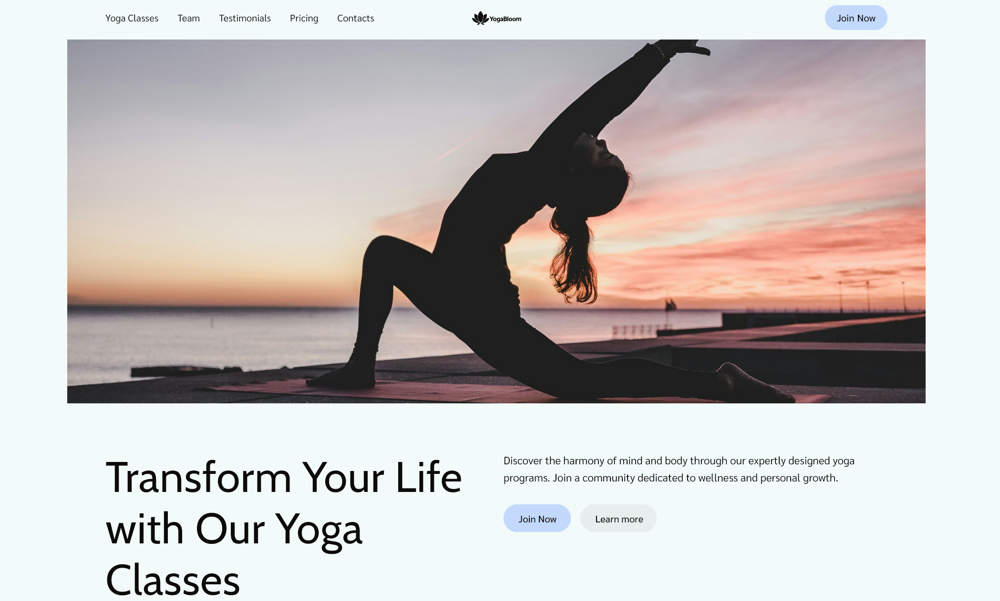

# 🌸 [YogaBloom <u>(website)</u>](https://zviacheslavv.github.io/biological-core-project/)

 
 

> A clean, responsive yoga learning website built to inspire balance and
> mindfulness.

**YogaBloom** is a front-end project showcasing a calm, user-friendly design for
a yoga studio or educational platform.
It focuses on simplicity, smooth animations, and adaptive layouts to provide a
serene experience across all devices.

---

## 🛠️ Tech Stack

- **JavaScript (ES6+)** – interactive UI and animations
- **CSS3** – Flexbox, media queries for responsive design
- **HTML5** – semantic and accessible structure
- **Vite** – fast development and optimized build system
- **Git** – version control and collaboration
- **Figma** – UI specification and layout alignment

## 🎼 Key Features

- **Landing-page–focused architecture** designed to promote a yoga studio with
  clear messaging and smooth user flows.
- **Fully responsive and adaptive layout** built with modern CSS (Flexbox, Media
  Queries).
- **Optimized front-end performance** through Vite, HTML injection plugins, and
  structured asset management.
- **Accessible and consistent UI** with normalized cross-browser styling.
- **Reusable component patterns** for layout, sections, and interactive
  elements.
- **Fast development workflow** powered by Vite’s hot-reload and full-reload
  plugins.

## 💥 Implemented Functionality

- **Complete implementation** of a full website section (HTML/CSS/JS) including
  layout, interactions, and adaptive behavior.
- **Modal window system** for sign-ups or promotional content (open/close logic,
  scroll lock, accessibility-safe focus handling).
- **Mobile navigation menu** with smooth open/close interactions\* and
  aria-friendly structure.
- **Scroll-based header behavior**, including hide/reveal on scroll for cleaner
  UX on mobile.
- **"Back to top" interaction** with smooth scrolling and contextual visibility.
- **Responsive layout architecture using Flexbox** + min/max breakpoints for
  consistent cross-device rendering.
- **CSS architecture optimization with PostCSS** and sorted media queries for
  maintainable and scalable styles.
